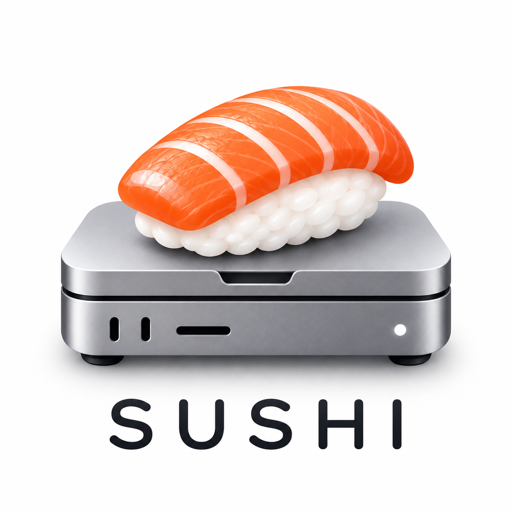
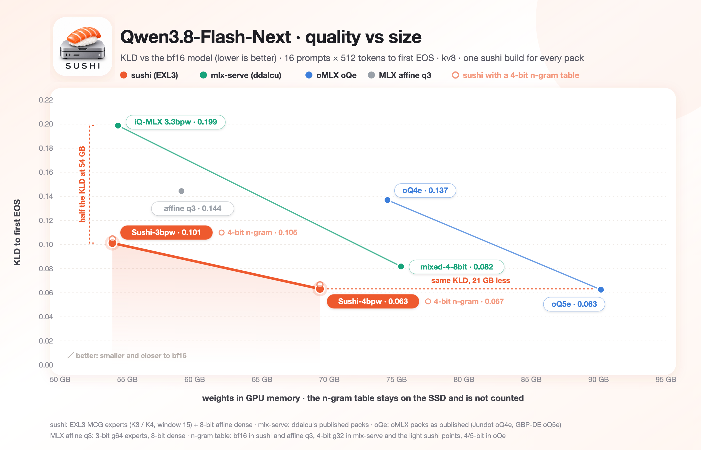
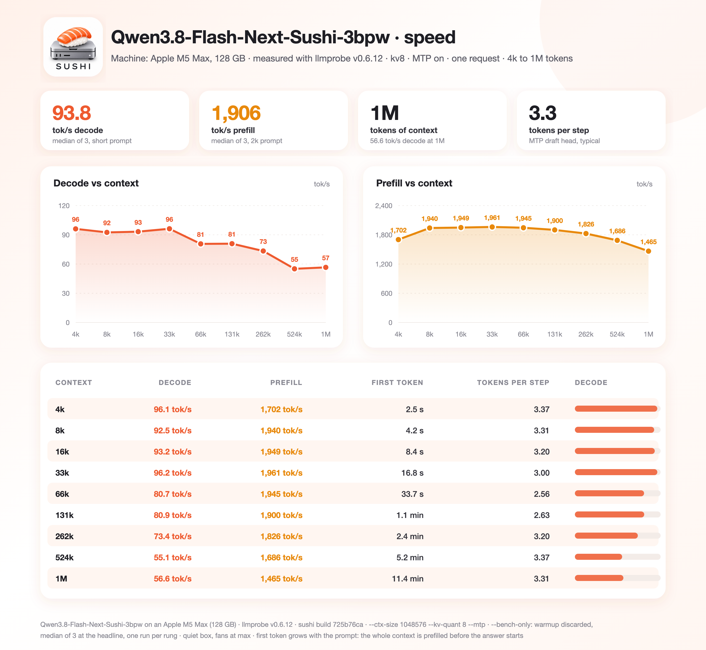

<p align="center"></p>

# SUSHI

A detached fork of [ddalcu's mlx-serve](https://github.com/ddalcu/mlx-serve) masterpiece, focused only on serving selected models on Apple Silicon with custom sushi quants. Sushi mixes EXL3 and affine formats tailored for M5 Max-class chips; other chips still run well. While Sushi works as a stand alone engine, it aims to stay within mlx-serve as a guest engine.

## Model support list

* [Qwen3.8-Flash-Next-Sushi-3bpw](https://huggingface.co/beamster/Qwen3.8-Flash-Next-Sushi-3bpw) (requires 64 GB+)
* [Qwen3.8-Flash-Next-Sushi-4bpw](https://huggingface.co/beamster/Qwen3.8-Flash-Next-Sushi-4bpw) (requires 96 GB+)

## Streaming

SSD expert streaming serves the bf16 Qwen3.8-Flash-Next checkpoint.

## Install

```bash
curl -L https://github.com/beamivalice/sushi/releases/latest/download/sushi-bin-macos-arm64.tar.gz | tar xz
./sushi-macos-arm64/sushi --version
```

The server listens on `127.0.0.1:12345` by default.

## Recommended launch

The model's own MTP draft head and the 8-bit KV cache are on by default.

**64 GB Mac, Sushi-3bpw**

Set the GPU memory limit first (it resets at reboot). 59,000 MB is the ceiling for this box: above it macOS runs out
of memory before the model does, and the kernel panics rather than the server refusing.
```bash
sudo sysctl iogpu.wired_limit_mb=59000
```

Then pick one of the two. They differ only in KV width; the context is set explicitly because auto-context reads free
memory, so its answer is not the same on two 64 GB machines.

```bash
hf download beamster/Qwen3.8-Flash-Next-Sushi-3bpw --local-dir ~/.sushi/models/Qwen3.8-Flash-Next-Sushi-3bpw

# 1. images, 8-bit KV — the default quality
./sushi-macos-arm64/sushi serve --model ~/.sushi/models/Qwen3.8-Flash-Next-Sushi-3bpw \
  --mtp --kv-quant 8 --mtp-head-kv-quant --ctx-size 128000 \
  --max-tokens 64000 --prefix-cache-disk 20GB --prefix-cache-entries 1 --prefix-cache-mem 1GB --temp 1

# 2. images, 4-bit KV — twice the context, at 9% KLD and 0.7 points of next-token agreement
./sushi-macos-arm64/sushi serve --model ~/.sushi/models/Qwen3.8-Flash-Next-Sushi-3bpw \
  --mtp --kv-quant 4 --mtp-head-kv-quant --ctx-size 256000 \
  --max-tokens 64000 --prefix-cache-disk 20GB --prefix-cache-entries 1 --prefix-cache-mem 1GB --temp 1
```

Add `--no-vision` to either one to stop serving images. It saves the 0.8 GB tower but not context: the tower is too
small to move the plan, so the two serve the same length.

Why those numbers. The pack holds 49.3 GB of resident weights and the limit is 57.6 GB. With an explicit context,
resident Flash-Next EXL3 loads without separate sidecars or ANE ask for the weights plus 2 GB for load/warmup scratch
and the context's cache bill, capped at the old 7 GB headroom. A smaller `--ctx-size` asks for less; auto context keeps
the old headroom. The 8-bit cache is about 16.6 KB per token (the memory table below), not the whole spare budget:
prompt processing and the prompt cache also need room. The KV cache grows as a conversation lengthens, so a short one
never spends the full budget; the context is a ceiling, not an up-front cost. The n-gram reader pools its reads when
the table cannot stay resident beside the weights, including at short contexts.

At 4-bit KV the quality cost is measured, not guessed: mean KLD 0.1047 to 0.1142 and next-token agreement 90.34% to
89.65% on the 16x512 teacher
([numbers](docs/quality-kld.md)). For scale, the w12-to-w15 window change bought 2.8%, so 4-bit KV gives back about
three times what the best expert tuning won. Prefer 1 unless you need the length.

`--wired-margin-gib` does nothing at this limit, because it only lowers a floor the working-set limit already sits
under.

Close a browser before serving if the load check refuses. The 30 GB n-gram table lives on the SSD, so its reads are the
cost of a 64 GB box, not a reason to raise the limit.

**96 GB+ Mac, Sushi-4bpw**

```bash
hf download beamster/Qwen3.8-Flash-Next-Sushi-4bpw --local-dir ~/.sushi/models/Qwen3.8-Flash-Next-Sushi-4bpw
./sushi-macos-arm64/sushi serve --model ~/.sushi/models/Qwen3.8-Flash-Next-Sushi-4bpw \
  --mtp --kv-quant 8 --mtp-head-kv-quant --ctx-size 500000 \
  --prefill-chunk 2048 --max-tokens 64000 --prefix-cache-disk 20GB \
  --prefix-cache-entries 1 --prefix-cache-mem 2GB --temp 1
```

Set the GPU memory limit before serving (it resets at reboot):
```bash
sudo sysctl iogpu.wired_limit_mb=88000    # 96 GB Mac
sudo sysctl iogpu.wired_limit_mb=120000   # 128 GB Mac
```

- `--mtp-head-kv-quant` stores the MTP head's own KV at 8 bits too.
- `--prefill-chunk 2048` caps the prompt tokens forwarded per step; 4096 prefills faster but needs more memory.
- `--prefix-cache-mem 1GB` keeps seen prompt prefixes hot in RAM, faster than the SSD.
- `--prefix-cache-disk 20GB` keeps seen prompt prefixes on the SSD, so a repeated prompt skips its prefill.
- `--mtp-typical 0.2` makes sampled decoding 15-20% faster (Sushi-4bpw, temperature 1.0) at a tiny quality cost.
- `--prefix-cache-entries 1` keeps one conversation's prefix; raise it to 4-8 when several agents share the server.

## Memory

GPU memory in GiB (what `sushi run` reports); the n-gram table stays on the SSD.

| | Sushi-3bpw | Sushi-4bpw |
|---|---|---|
| model weights | 47.51 | 61.58 |
| MTP head | 0.98 | 1.27 |
| vision tower | 0.84 | 0.84 |
| **weights loaded** | **49.33** | **63.68** |
| KV cache, 256k tokens | 4.06 | 4.06 |
| KV cache, 512k tokens | 8.12 | 8.12 |
| KV cache, 1M tokens | 16.25 | 16.25 |
| **total at 256k / 512k / 1M** | **53.4 / 57.5 / 65.6** | **67.7 / 71.8 / 79.9** |

The KV cache is for one request at 8 bits with MTP on and `--mtp-head-kv-quant`: 16,640 bytes per token of context.
Leave room for the hot prefix cache (`--prefix-cache-mem`) and the prefill buffers.

## Quality

<p align="center"></p>

KLD against the bf16 model: 16 prompts x 512 tokens scored to the first EOS, kv8, every pack run by the same sushi
build. The light rings are the sushi packs with a 4-bit n-gram table (Sushi-3bpw ships that table; either table works
with either pack). Numbers: [docs/quality-kld.md](docs/quality-kld.md).

## Speed

Sushi-3bpw on an M5 Max 128 GB, sushi v1.0.0 release candidate (build 725b76ca): `--ctx-size 1048576 --kv-quant 8 --mtp`, llmprobe `--bench-only`, quiet box.

<p align="center"></p>

Smaller Macs have less memory bandwidth, so expect lower numbers. Chips before M5 also lack the neural accelerators:
an M2 Max 64 GB measured 124-141 tok/s prefill at 3-4k tokens and 33 tok/s decode
([numbers](docs/perf-baselines.md#m2max-64gb)).

## License

MIT, for sushi and the mlx-serve code it forks ([LICENSE](LICENSE)); ported kernels and vendored code are listed in
[NOTICE](NOTICE). The model packs follow the Qwen Community License, stated on each Hugging Face page.
